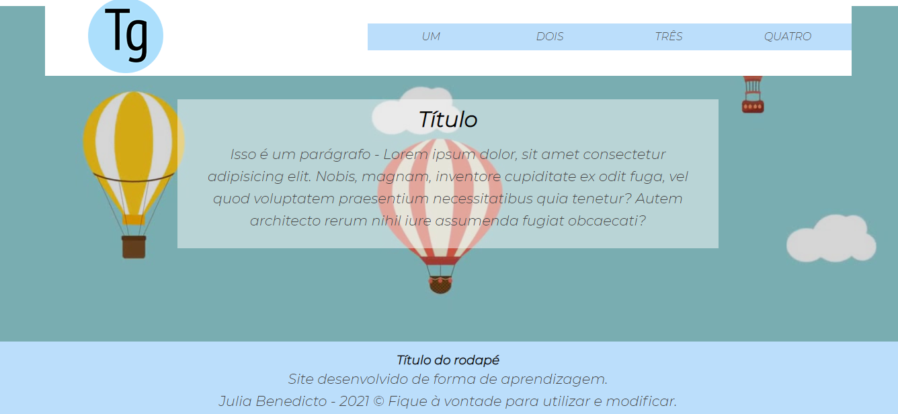

# Layout Simples

 

## Índice

- [1. Sobre o projeto](#1-sobre-o-projeto)
- [2. Ferramentas utilizadas](#2-ferramentas-utilizadas)
- [3. Autora](#3-autora)

--- 
## 1. Sobre o projeto

Layout desenvolvido com HTML e CSS, criado por mim. O objetivo do layout é leveza e delicadeza , ele utiliza a fonte do Google Montserrat - Regular e Bold.
Ele tem apenas uma página, você é livre para adicionar e modificar.

## 2. Ferramentas utilizadas

- HTML
- CSS

## 3. Autora

<a href="https://www.linkedin.com/in/julia-benedicto/">Julia Benedicto</a>